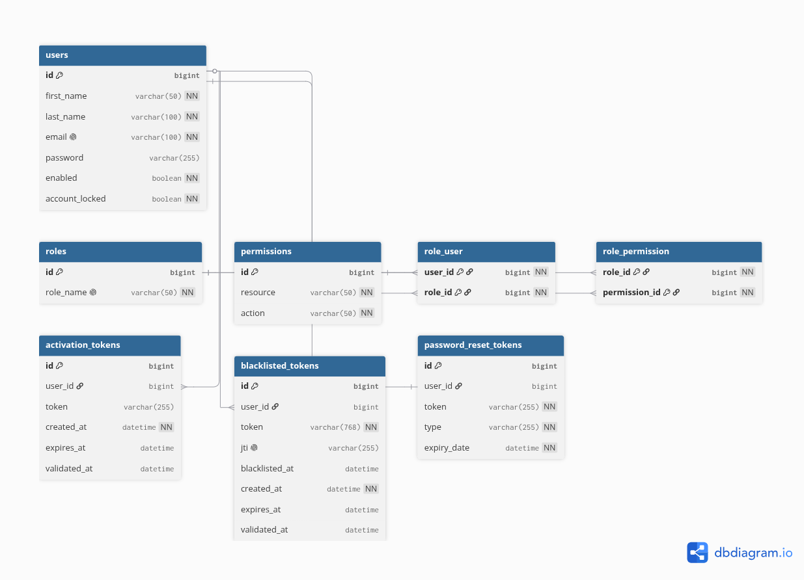

# flask_tutorial

A complete, hands-on tutorial for building a CRUD REST API with **Flask 3** and **Python 3.12+**. Organized into Git branches that progressively cover most of the key concepts of the Flask ecosystem.

The data model follows `categories` → `products` → `customers` ← `orders`, secured by a hand-rolled JWT authentication system with role/permission-based access control, including email-based account activation, password reset, and token revocation (see [feature/auth](#featureauth)).

This document is the **complete specification** of the project: it is meant to be followed step by step to implement each branch. It supersedes the earlier scaffolding done on `feature/templating`, `feature/config`, and `feature/data-modeling` (a server-rendered Bootstrap/Jinja2 home page): from `feature/core-architecture` onward, this tutorial is a pure JSON REST API, with no server-rendered views.

## Table of contents

- [Why these library choices](#why-these-library-choices)
- [Tech stack](#tech-stack)
- [Data model](#data-model)
- [Two API styles: Class-based Views vs. Function-based Views](#two-api-styles-class-based-views-vs-function-based-views)
- [Branching strategy](#branching-strategy)
- [Project structure](#project-structure)
- [Standard response format](#standard-response-format)
- [Testing strategy](#testing-strategy)
- [Git commit convention](#git-commit-convention)
- [feature/core-architecture](#featurecore-architecture)
- [feature/categories](#featurecategories)
- [feature/products](#featureproducts)
- [feature/customers](#featurecustomers)
- [feature/orders](#featureorders)
- [feature/auth](#featureauth)
- [Order of work](#order-of-work)
- [Code conventions](#code-conventions)
- [Concepts covered](#concepts-covered)
- [How to follow this tutorial](#how-to-follow-this-tutorial)

## Why these library choices

- **APIFlask instead of Flask-RESTX/flasgger**: APIFlask is actively maintained (unlike Flask-RESTPlus, its dead predecessor) and generates OpenAPI/Swagger UI directly from the same Marshmallow schemas used for request validation and serialization — one schema, not a schema plus a separate set of doc annotations.
- **Marshmallow instead of Pydantic**: Flask + Marshmallow is the long-standing idiomatic pairing, and `marshmallow-sqlalchemy` maps SQLAlchemy models to schemas with minimal boilerplate. Pydantic's Flask integration is comparatively immature next to its native fit in ASGI frameworks.
- **`werkzeug.security` instead of Passlib**: Werkzeug is already a Flask dependency, and its default hasher (scrypt) is strong — no need for an extra dependency, especially since Passlib has had no meaningful releases since 2020.
- **Flask-JWT-Extended instead of Flask-Login or Flask-Security-Too**: this tutorial's auth schema (`users`, `roles`, `permissions`, `role_user`, `role_permission`, and a `blacklisted_tokens` table keyed by `jti`) is modeled by hand rather than delegated to a framework. Flask-Security-Too would impose its own user/role schema and duplicate what this tutorial is trying to teach; Flask-Login is cookie/session-oriented, not JWT-oriented. Flask-JWT-Extended gives just the JWT primitives needed (`jti` claim, a `token_in_blocklist_loader` hook) without owning the data model.
- **Flask-SQLAlchemy / Flask-Migrate instead of bare SQLAlchemy + Alembic CLI**: keeps database configuration wired into the Flask application factory/config object, which is how most real Flask projects are structured.

## Tech stack

| Component | Choice |
|---|---|
| Framework | Flask 3 |
| Language | Python 3.12+ |
| Database | PostgreSQL 16 (via Docker Compose) |
| ORM | SQLAlchemy 2 (via Flask-SQLAlchemy) |
| Migrations | Flask-Migrate (Alembic) |
| DTO / validation / serialization | Marshmallow (+ `marshmallow-sqlalchemy`) |
| API documentation | APIFlask (Swagger UI, generated from Marshmallow schemas) |
| Monitoring | Custom `/health` blueprint (DB connectivity check) |
| Email sending | Flask-Mail (SMTP), backed in dev by [Mailtrap](https://mailtrap.io)/[Mailpit](https://github.com/axllent/mailpit) |
| Authentication | Flask-JWT-Extended (JWT, with a persisted blacklist), `werkzeug.security` for password hashing |
| Tests | pytest, pytest-mock, testcontainers-python, Flask's `test_client()` |
| Linting/formatting | ruff |
| CI/CD | GitHub Actions |
| Containerization | Docker, docker-compose |

## Data model


```
categories (id, category_name)
    │ 1
    │
    │ N
products (id, category_id, product_name, unit_price)
    │ 1
    │
    │ N
orders (id, customer_id, product_id, quantity, total)
    │ N
    │
    │ 1
customers (id, first_name, last_name, telephone, email, address)
```

### Column details

**categories**
| Column | Type | Constraints |
|---|---|---|
| id | BIGINT | PK, auto-increment |
| category_name | VARCHAR(255) | NOT NULL |

**products**
| Column | Type | Constraints |
|---|---|---|
| id | BIGINT | PK, auto-increment |
| category_id | BIGINT | FK → categories.id, NOT NULL |
| product_name | VARCHAR(255) | NOT NULL |
| unit_price | FLOAT | NOT NULL, > 0 |

**customers**
| Column | Type | Constraints |
|---|---|---|
| id | BIGINT | PK, auto-increment |
| first_name | VARCHAR(255) | NOT NULL |
| last_name | VARCHAR(255) | NOT NULL |
| telephone | VARCHAR(50) | NOT NULL |
| email | VARCHAR(255) | NOT NULL, UNIQUE |
| address | VARCHAR(255) | NOT NULL |

**orders**
| Column | Type | Constraints |
|---|---|---|
| id | BIGINT | PK, auto-increment |
| customer_id | BIGINT | FK → customers.id, NOT NULL |
| product_id | BIGINT | FK → products.id, NOT NULL |
| quantity | INT | NOT NULL, > 0 |
| total | DOUBLE | NOT NULL, computed = quantity × unit_price |

## Two API styles: Class-based Views vs. Function-based Views

Flask supports two equally idiomatic ways of exposing HTTP endpoints, and this tutorial deliberately uses both:

- **Class-based Views** (`flask.views.MethodView`, one class per resource, registered via `add_url_rule`) for `categories`, `products`, and `orders`: the full CRUD verb set for a resource lives together as `get`/`post`/`put`/`delete` methods on one class, closest in spirit to attribute-routed controllers.
- **Function-based Views** (`@blueprint.route(...)`, one function per endpoint) for `customers` and `auth`: Flask's original, lightweight style, with each route declared and validated independently.

Both styles share the exact same service layer underneath, and both use `APIFlask`'s `@app.input`/`@app.output` decorators against the same Marshmallow schemas for validation and OpenAPI generation — only the way an HTTP request reaches a use case changes.

## Branching strategy

| Branch | Role |
|---|---|
| `master` | Stable, production-ready code. No direct commits, only merges from `develop`. |
| `develop` | Integration branch. All `feature/*` branches are merged here before `master`. |
| `feature/core-architecture` | Technical foundation: project structure, Flask app factory, SQLAlchemy/PostgreSQL configuration, Docker, CI. |
| `feature/categories` | `Category` CRUD, class-based views. |
| `feature/products` | `Product` CRUD, class-based views (depends on `categories`). |
| `feature/customers` | `Customer` CRUD, function-based views. |
| `feature/orders` | `Order` CRUD, class-based views, computes `total`. |
| `feature/auth` | Authentication and authorization (JWT + hand-rolled RBAC), including account activation, password reset, and token revocation by email/blacklist. |

## Project structure

```
flask_tutorial/
├── .github/
│   ├── workflows/
│   │   ├── ci.yml                            # pip install + pytest
│   │   └── pr-checks.yml                     # commit message lint on the PR range
│   └── PULL_REQUEST_TEMPLATE.md
├── app.py                                    # entry point: creates the app via create_app()
├── requirements.txt
├── requirements-dev.txt
├── flask_tutorial/
│   ├── __init__.py                           # create_app() application factory
│   ├── config.py                             # Config / DevConfig / TestConfig / ProdConfig, read from env
│   ├── extensions.py                         # db, migrate, jwt, mail, api (APIFlask) singletons
│   ├── blueprints/
│   │   ├── categories/
│   │   │   └── views.py                      (CategoryView, MethodView)
│   │   ├── products/
│   │   │   └── views.py                      (ProductView, MethodView)
│   │   ├── customers/
│   │   │   └── views.py                      (function-based routes, one per endpoint)
│   │   ├── orders/
│   │   │   └── views.py                      (OrderView, MethodView)
│   │   ├── auth/
│   │   │   └── views.py                      (function-based routes: register, login, me, ...)
│   │   └── health/
│   │       └── views.py                      (GET /health)
│   ├── models/
│   │   ├── category.py
│   │   ├── product.py
│   │   ├── customer.py
│   │   ├── order.py
│   │   └── identity/
│   │       ├── user.py
│   │       ├── role.py
│   │       ├── permission.py
│   │       ├── activation_token.py
│   │       ├── password_reset_token.py
│   │       └── blacklisted_token.py
│   ├── schemas/
│   │   ├── common.py                         (ApiResponse, PageResponse helpers)
│   │   ├── category.py, product.py, customer.py, order.py
│   │   └── auth.py                           (RegisterSchema, LoginSchema, ConfirmEmailSchema, ...)
│   ├── services/
│   │   ├── category_service.py, product_service.py, customer_service.py, order_service.py
│   │   ├── auth_service.py
│   │   └── email_service.py                  (Flask-Mail wrapper)
│   ├── errors.py                             # ResourceNotFoundError, BusinessRuleError
│   └── error_handlers.py                     # app.errorhandler registrations
├── migrations/                                # generated by Flask-Migrate (Alembic)
├── tests/
│   ├── unit/                                  (pytest-mock)
│   ├── integration/                           (testcontainers-python, real PostgreSQL)
│   └── e2e/                                   (Flask's test_client())
├── docker-compose.yml
└── Dockerfile
```

## Standard response format

Every response (success and error alike) is wrapped in a generic `ApiResponse` structure.

```python
from dataclasses import dataclass, asdict, field
from datetime import datetime, timezone
from typing import Generic, TypeVar

T = TypeVar("T")

@dataclass
class ApiResponse(Generic[T]):
    success: bool
    message: str
    data: T | None
    timestamp: datetime = field(default_factory=lambda: datetime.now(timezone.utc))

    @classmethod
    def ok(cls, data: T, message: str) -> "ApiResponse[T]":
        return cls(success=True, message=message, data=data)

    @classmethod
    def fail(cls, message: str) -> "ApiResponse[None]":
        return cls(success=False, message=message, data=None)

    def to_dict(self) -> dict:
        return asdict(self)
```

- List endpoints wrap their content in `ApiResponse[PageResponse[T]]` (`PageResponse` carries `items`, `page`, `page_size`, `total_count`, `total_pages`).
- `error_handlers.py` registers `@app.errorhandler` for `ResourceNotFoundError` (404), Marshmallow `ValidationError` (400, with a field-level error list), `BusinessRuleError` (422), and any other exception (500) — always returning an `ApiResponse` with `success = False`.

## Testing strategy

Every branch from `feature/products` onward is expected to ship all three test layers before its Pull Request is opened: no branch is "done" with only unit tests.

Services query SQLAlchemy directly (`Model.query`/`db.session`) — there's no repository layer to swap in a fake, so "unit" and "integration" split along a different line than mocking-vs-real-DB:

| Layer | Tool | What it verifies | Lives in |
|---|---|---|---|
| Unit | pytest + pytest-mock | Logic that doesn't need a real database: pure computations (e.g. `PageResponse.total_pages`, `Order.total`), and service branches driven by mocking the SQLAlchemy call site (e.g. `Category.query`) or an external dependency (JWT helpers, `email_service`) — no HTTP | `tests/unit/` |
| Integration | pytest + testcontainers-python (real PostgreSQL container) | Full service behavior against a real, disposable database: persistence, pagination, business rules that need real data (e.g. FK relationships), migrations, model-level constraints | `tests/integration/` |
| E2E | pytest + Flask's `test_client()` (backed by the same Testcontainers PostgreSQL instance) | The full request pipeline (routing, schema validation, error handlers, `ApiResponse` envelope, real HTTP status codes) for both class-based and function-based views | `tests/e2e/` |

`.github/workflows/ci.yml` runs `pytest` across the whole suite, so all three layers execute on every push/PR; a branch's checklist is not complete until `pytest` passes locally with all three test directories included.

## Git commit convention

All commits follow **Conventional Commits**, checked in CI on every Pull Request (`.github/workflows/pr-checks.yml`).

### Format

```
<type>(<scope>): <short summary>

<body — what was done and why, one sentence per file touched>

<footer — refs, breaking changes>
```

### Types

| Type | When to use |
|---|---|
| `feat` | New feature or file |
| `fix` | Bug fix |
| `refactor` | Code change that is neither a bug fix nor a feature |
| `test` | Adding or updating tests |
| `docs` | Documentation only |
| `chore` | Tooling, config, deps |
| `ci` | CI pipeline/workflow changes |
| `style` | Formatting (`ruff format`), no logic change |
| `perf` | Performance improvement |

### Atomic commit rule

> **One commit per file added or modified.** Never group unrelated files in a single commit.

**Good:**
```
feat(categories): add Category model

- Defines the Category SQLAlchemy model with id and category_name columns.
```

**Bad:**
```
feat: add categories feature with model, schema, service and view
```

### Tooling

- **CI** (`.github/workflows/pr-checks.yml`): validates every commit message on the PR range (`git log <base>..<head>`) against the Conventional Commits pattern (a small regex check, no extra dependency)
- `.github/PULL_REQUEST_TEMPLATE.md`: branch name, task checklist, commit summary, test checklist (unit/integration/E2E pass, `pytest` green), code review checklist (no business logic in views, schemas validated, endpoints return `ApiResponse`, atomic commits)

## feature/core-architecture

Technical foundation: project scaffolding, SQLAlchemy/PostgreSQL setup, Docker, CI. No business logic yet.

### Tasks

- [x] `create_app()` application factory in `flask_tutorial/__init__.py`, entry point in `app.py`
- [x] `requirements.txt`: `Flask`, `Flask-SQLAlchemy`, `Flask-Migrate`, `psycopg[binary]`, `marshmallow`, `marshmallow-sqlalchemy`, `apiflask`, `flask-jwt-extended`, `flask-mail`, `python-dotenv`
- [x] `requirements-dev.txt`: `pytest`, `pytest-mock`, `pytest-flask`, `testcontainers[postgres]`, `ruff`
- [x] Package layout above (`blueprints`, `models`, `schemas`, `services`, `errors.py`, `error_handlers.py`) — `models`/`services` are empty packages until `feature/categories` starts populating them
- [x] `config.py`: `Config`/`DevConfig`/`TestConfig`/`ProdConfig` classes reading from environment variables — PostgreSQL URI, JWT secret/expiry, SMTP settings (`MAIL_SERVER`, `MAIL_PORT`, `MAIL_USERNAME`, `MAIL_PASSWORD`, `MAIL_DEFAULT_SENDER`), and the frontend base URL used to build activation/reset links (`FRONTEND_URL`)
- [x] `extensions.py`: `db` (`SQLAlchemy`), `migrate` (`Migrate`), `jwt` (`JWTManager`), `mail` (`Mail`) instances, initialized in `create_app()`; the APIFlask app itself (playing the role of `api`) is constructed directly in `create_app()`
- [ ] Initial migration (`flask db init`, `flask db migrate -m "initial"`, `flask db upgrade`) — `flask db init` is done (`migrations/` scaffold committed); `migrate`/`upgrade` need a reachable PostgreSQL instance and are still pending
- [x] `errors.py` (`ResourceNotFoundError`, `BusinessRuleError`), `error_handlers.py`, `ApiResponse`/`PageResponse` in `schemas/common.py`
- [x] `error_handlers.py`: a catch-all 404 handler returning `ApiResponse.fail("Resource not found")` for any unmatched route, so an unknown URL stays consistent with the rest of the API's response envelope instead of falling back to Flask's plain 404 page
- [x] APIFlask Swagger UI configuration, including the "Authorize" button (Bearer JWT) for later use in `feature/auth`
- [x] `health` blueprint: `GET /health` pings the database and returns `ApiResponse.ok({"status": "up"}, ...)`
- [x] `docker-compose.yml` (API only — reuses an already-running local PostgreSQL container instead of provisioning a new one, see `.claude/CLAUDE.md`'s "Branch workflow"), `Dockerfile` (multi-stage)
- [x] `.github/workflows/ci.yml`: `pip install -r requirements.txt -r requirements-dev.txt` + `pytest`
- [x] `.github/workflows/pr-checks.yml`: validates every commit message on the PR range against the Conventional Commits pattern
- [x] `.github/PULL_REQUEST_TEMPLATE.md`: branch, task checklist, commit summary, test checklist, code review checklist
- [x] Test project scaffolding: `tests/unit/`, `tests/integration/`, `tests/e2e/`, a `conftest.py` providing the Flask `test_client()` fixture (a Testcontainers PostgreSQL fixture is added once `feature/products` introduces the first integration tests)
- [x] Unit tests: `error_handlers` map `ResourceNotFoundError` to 404, a Marshmallow `ValidationError` to 400 with a field-level error list, `BusinessRuleError` to 422, and any other exception to 500, always inside an `ApiResponse` with `success = False`
- [x] E2E test: `GET /health` returns 200
- [x] E2E test: an unmatched route returns 404 with the `ApiResponse` shape (`success = False`)

## feature/categories

Class-based views (`MethodView`).

### Endpoints

| Method | URL | Description |
|---|---|---|
| GET | `/api/v1/categories` | Paginated list |
| GET | `/api/v1/categories/{id}` | Detail |
| POST | `/api/v1/categories` | Create |
| PUT | `/api/v1/categories/{id}` | Update |
| DELETE | `/api/v1/categories/{id}` | Delete |

### Tasks

- [x] `Category` SQLAlchemy model
- [x] `CategorySchema` (Marshmallow), reused for input validation, output serialization, and OpenAPI generation
- [x] `CategoryService` (business logic, queries `Category.query`/`db.session` directly — no repository layer)
- [x] `CategoryView` (`MethodView`), registered under `/api/v1/categories` via a Blueprint — implemented as two `MethodView` classes (`CategoryListView` for GET-list/POST, `CategoryDetailView` for GET/PUT/DELETE by id), since APIFlask's `@app.output` needs one fixed schema per view method and list/detail responses differ in shape
- [x] Unit tests (pytest-mock): `CategoryService`: `get_by_id`/`update`/`delete` raise `ResourceNotFoundError` for an unknown id (mocking the `db.session.get` call site) — the rest of `CategoryService`'s behavior (pagination, persistence) is thin enough that it's covered by the integration layer instead of being mocked
- [x] Integration tests (testcontainers-python, PostgreSQL): `CategoryService` against a real database: pagination, create/update/delete persistence, `category_name` NOT NULL constraint enforced by the database
- [x] E2E tests (Flask `test_client()`): full CRUD lifecycle on `/api/v1/categories`; 404 `ApiResponse` for an unknown id; pagination; 400 on a missing required field

## feature/products

Class-based views (`MethodView`). Depends on `feature/categories` (a product belongs to a category).

### Endpoints

| Method | URL | Description |
|---|---|---|
| GET | `/api/v1/products` | Paginated list, filterable by `category_id` |
| GET | `/api/v1/products/{id}` | Detail |
| POST | `/api/v1/products` | Create |
| PUT | `/api/v1/products/{id}` | Update |
| DELETE | `/api/v1/products/{id}` | Delete |

### Tasks

- [x] `Product` SQLAlchemy model (many-to-one relationship to `Category`)
- [x] `ProductSchema` (Marshmallow)
- [x] `ProductService` (queries `Product.query`/`db.session` directly; also checks the referenced category exists on create/update, raising `ResourceNotFoundError` — same pattern as `feature/orders`' customer/product existence check)
- [x] Business rule: deleting a category that still has products is forbidden (`BusinessRuleError`) — extends `CategoryService.delete` now that `Product` exists
- [x] `ProductView` (`MethodView`) — same two-class split as `CategoryView` (`ProductListView`, `ProductDetailView`)
- [x] Unit tests (pytest-mock): `CategoryService.delete` on a category with products raises `BusinessRuleError` (mocking the products-exist check)
- [x] Integration tests (testcontainers-python, PostgreSQL): `ProductService` against a real database: pagination and `category_id` filter, category→product relationship loads correctly, unique/FK constraints enforced by the database, deleting a category that still has products raises `BusinessRuleError` against real rows
- [x] E2E tests (Flask `test_client()`): full CRUD lifecycle on `/api/v1/products`; `category_id` filter on the products list; 404 `ApiResponse` for an unknown id; 422 `ApiResponse` when deleting a category that still has products

## feature/customers

Function-based views.

### Endpoints

| Method | URL | Description |
|---|---|---|
| GET | `/api/v1/customers` | Paginated list, search by name (`?search=`) |
| GET | `/api/v1/customers/{id}` | Detail |
| POST | `/api/v1/customers` | Create |
| PUT | `/api/v1/customers/{id}` | Update |
| DELETE | `/api/v1/customers/{id}` | Delete |

### Tasks

- [x] `Customer` SQLAlchemy model
- [x] `CustomerSchema` (Marshmallow, email uniqueness enforced in the service)
- [x] `CustomerService` (queries `Customer.query`/`db.session` directly)
- [x] `blueprints/customers/views.py`: one `@customers_bp.route(...)` function per endpoint, grouped under `/api/v1/customers`, each decorated with `@app.input`/`@app.output` against `CustomerSchema`
- [x] Registered in `create_app()` via `app.register_blueprint(customers_bp)`
- [x] Unit tests (pytest-mock): `CustomerService`: `create`/`update` raise a `BusinessRuleError` on a duplicate email (mocking the email-lookup call site), except when the email belongs to the same customer being updated
- [x] Integration tests (testcontainers-python, PostgreSQL): `CustomerService` against a real database: name/email search query, unique email constraint enforced by the database
- [x] E2E tests (Flask `test_client()`): full CRUD lifecycle on `/api/v1/customers`; `search` query parameter; 400 `ApiResponse` with field-level errors on a validation failure; 422 on duplicate email

## feature/orders

Class-based views (`MethodView`).

### Endpoints

| Method | URL | Description |
|---|---|---|
| GET | `/api/v1/orders` | Paginated list, filterable by `customer_id`/`product_id` |
| GET | `/api/v1/orders/{id}` | Detail |
| POST | `/api/v1/orders` | Create (computes `total`) |
| PUT | `/api/v1/orders/{id}` | Update |
| DELETE | `/api/v1/orders/{id}` | Delete |

### Tasks

- [ ] `Order` SQLAlchemy model (foreign keys to `Customer` and `Product`)
- [ ] `OrderSchema` (Marshmallow)
- [ ] `OrderService`: queries `Order.query`/`db.session` directly (eager-loading related `Customer`/`Product` via `joinedload`), computes `total = quantity * product.unit_price`, checks that the customer and product exist
- [ ] `OrderView` (`MethodView`)
- [ ] Unit tests (pytest-mock): `total` computation as a pure function/method (`quantity * product.unit_price`), independent of persistence
- [ ] Integration tests (testcontainers-python, PostgreSQL): `OrderService` against a real database: `total` is computed and persisted correctly; recomputes `total` on update when `quantity` changes; raises `ResourceNotFoundError` when the customer or product does not exist; eager-loaded query returns the related `Customer`/`Product` data; `customer_id`/`product_id` filters
- [ ] E2E tests (Flask `test_client()`): full CRUD lifecycle on `/api/v1/orders`; `POST` stores the correct computed `total`; `customer_id`/`product_id` filters on the list endpoint; 404 `ApiResponse` when creating an order for an unknown customer or product

## feature/auth

Full authentication and authorization: JWT (Flask-JWT-Extended) over a hand-rolled RBAC schema, plus **email account activation**, **password reset**, and **token revocation**, all driven by tokens sent by email or persisted server-side.



Unlike a framework-managed identity system, every table here is modeled explicitly, matching the diagram above:

| Concern | How it's implemented |
|---|---|
| Users | `users` table (`User` model); `enabled`/`account_locked` booleans control activation and lockout directly |
| Roles & permissions | `roles`, `permissions` (`resource` + `action`), `role_user` (M2M), `role_permission` (M2M) — fine-grained resource/action permissions rather than plain role names; authorization is checked as "does any of the user's roles carry a permission for `(resource, action)`" |
| Password hashing | `werkzeug.security.generate_password_hash` / `check_password_hash` |
| JWT issuance | Flask-JWT-Extended `create_access_token`, with the user's resolved permissions embedded as a custom claim |
| Token revocation | `blacklisted_tokens` table keyed by `jti` (unique); Flask-JWT-Extended's `token_in_blocklist_loader` checks it on every protected request — `logout` inserts the current token's `jti` |
| Account activation | `activation_tokens` table: an opaque random token persisted with `expires_at`/`validated_at`, emailed as a link, consumed once |
| Password reset | `password_reset_tokens` table (same shape, plus a `type` column), emailed as a link, consumed once |

There is deliberately no refresh-token flow in this schema: access tokens are short-lived, and revocation before expiry is handled by the blacklist rather than by rotating a separate refresh token.

### Endpoints

| Method | URL | Description | Access |
|---|---|---|---|
| POST | `/api/v1/auth/register` | Sign up, sends an account-confirmation email | Public |
| POST | `/api/v1/auth/confirm-email` | Confirm the account from the emailed token | Public |
| POST | `/api/v1/auth/resend-confirmation` | Re-send the confirmation email | Public |
| POST | `/api/v1/auth/login` | Sign in, returns a JWT (rejected while the account is unconfirmed or locked) | Public |
| GET | `/api/v1/auth/me` | Current user profile | Authenticated |
| POST | `/api/v1/auth/logout` | Revoke the current access token (adds its `jti` to `blacklisted_tokens`) | Authenticated |
| POST | `/api/v1/auth/forgot-password` | Send a password reset email | Public |
| POST | `/api/v1/auth/reset-password` | Consume the reset token, set a new password | Public |

### Authorization rules

| Resource | GET | POST/PUT/DELETE |
|---|---|---|
| categories, products | Public | Requires the matching `resource:action` permission (granted to `Admin` by default) |
| customers, orders | Authenticated | Requires the matching `resource:action` permission (granted to `Admin` by default) |

### Tasks

- [ ] Models: `User`, `Role`, `Permission`, `role_user`/`role_permission` association tables, `ActivationToken`, `PasswordResetToken`, `BlacklistedToken`
- [ ] Seed script/CLI command: default `Admin` role (all permissions) and `User` role (read-only permissions on `categories`/`products`)
- [ ] `extensions.py`: `jwt = JWTManager()`, initialized in `create_app()`; `jwt.token_in_blocklist_loader` checks `BlacklistedToken` by `jti`
- [ ] `email_service.py` (Flask-Mail wrapper): `send(to, subject, html_body)`, reading `MAIL_*` settings from `config.py`
- [ ] `auth_service.py`:
  - `register`: creates the `User` (`enabled=False`), generates an `ActivationToken`, builds a confirmation link (`FRONTEND_URL` + token), sends it via `email_service`
  - `confirm_email`: looks up the `ActivationToken`, checks `expires_at`, sets `User.enabled = True` and `ActivationToken.validated_at`
  - `resend_confirmation`: re-issues a fresh activation token if the account exists and is not yet enabled (same generic response either way, to avoid leaking account existence)
  - `login`: rejects with a clear error if `enabled` is `False` or `account_locked` is `True`, before checking the password
  - `logout`: inserts the current token's `jti` into `BlacklistedToken`
  - `forgot_password`: generates a `PasswordResetToken`, builds a reset link, sends it via `email_service` (always returns a generic success message, whether or not the email exists)
  - `reset_password`: validates the `PasswordResetToken` (not expired, not reused), updates the password hash
- [ ] `RegisterSchema`, `LoginSchema`, `ConfirmEmailSchema` (`email`, `token`), `ResendConfirmationSchema` (`email`), `ForgotPasswordSchema` (`email`), `ResetPasswordSchema` (`email`, `token`, `new_password`) — Marshmallow schemas
- [ ] `blueprints/auth/views.py` (function-based routes: `register`, `confirm-email`, `resend-confirmation`, `login`, `me`, `logout`, `forgot-password`, `reset-password`)
- [ ] A permission-checking decorator (e.g. `@require_permission("categories", "create")`) applied to the mutating routes/views across all resources
- [ ] Swagger UI: JWT Bearer security scheme wired to the "Authorize" button
- [ ] Dev setup: point `MAIL_*` at a local catcher (e.g. [Mailpit](https://github.com/axllent/mailpit) via `docker-compose`, or [Mailtrap](https://mailtrap.io)) so confirmation/reset emails can be inspected without a real mailbox
- [ ] A fake `email_service` (captures sent messages instead of hitting SMTP), used by both the integration and E2E tests below via a pytest fixture
- [ ] Unit tests (pytest-mock): `auth_service`: `register` calls `email_service` with a confirmation link (mocking `email_service`); `login` raises when `enabled` is `False` or `account_locked` is `True`, before checking the password (mocking the user lookup); `forgot_password` always returns the same generic message whether or not the account exists
- [ ] Integration tests (testcontainers-python, PostgreSQL): `auth_service` against a real database: `register` persists the user disabled; role/permission assignment persists across `role_user`/`role_permission`; `reset_password` rejects an expired or already-used token; a test JWT issued directly against a known signing key is accepted by protected routes and rejected once its `jti` is inserted into `blacklisted_tokens`
- [ ] E2E tests (Flask `test_client()` + the fake `email_service`): register → confirmation email captured → `confirm-email` with the captured token succeeds → `login` succeeds; `login` fails while the account is unconfirmed; `forgot-password` → `reset-password` with the captured token → `login` with the new password succeeds; `reset-password` with a stale/reused token fails; `logout` then reusing the same access token returns 401; role-based access: a `User`-role account gets 403 on `POST /categories`, an `Admin`-role account succeeds, an unauthenticated request gets 401 on `GET /customers`

## Order of work

1. `feature/core-architecture` → Pull Request to `develop`
2. `feature/categories` (depends on `core-architecture`) → Pull Request to `develop`
3. `feature/products` (depends on `categories`) → Pull Request to `develop`
4. `feature/customers` (depends on `core-architecture`) → Pull Request to `develop`
5. `feature/orders` (depends on `products` and `customers`) → Pull Request to `develop`
6. `feature/auth` (secures everything) → Pull Request to `develop`
7. `develop` → `master` once everything is tested and validated

## Code conventions

- Package root: `flask_tutorial`, one subpackage per concern (`blueprints`, `models`, `schemas`, `services`)
- DTOs: Marshmallow `Schema` classes
- **No repository layer**: `Model.query`/`db.session` is already Flask-SQLAlchemy's data-access abstraction, so a hand-rolled repository class on top of it would just be indirection with no payoff here (no swappable persistence backend, no multi-ORM support). Business logic lives in `services/`, which query SQLAlchemy directly; views/blueprints never query the database directly and never contain business logic
- Every view returns an `ApiResponse` (or `ApiResponse[PageResponse[T]]` for lists)
- Any service method that writes to the database does so within a single request-scoped SQLAlchemy session, committing once and rolling back on failure
- SQLAlchemy models use the declarative style (`Column`/`relationship` on the class itself) — the idiomatic Flask-SQLAlchemy approach, unlike a strict separation of persistence mapping from the domain class

## Concepts covered

- Flask fundamentals (application factory, Blueprints, routing, dependency wiring via `extensions.py`)
- Two view styles side by side: class-based (`MethodView`) and function-based
- SQLAlchemy: declarative models, relationships, Flask-Migrate/Alembic migrations
- DTOs, validation, and serialization (Marshmallow)
- Centralized error handling (`error_handlers.py`)
- Generic `ApiResponse` response contract
- A service layer that talks to SQLAlchemy directly, kept thin and testable without a repository abstraction
- Authentication and authorization (JWT via Flask-JWT-Extended, hand-rolled role/permission RBAC)
- Account activation, password reset, and token revocation via emailed/persisted tokens
- API documentation (APIFlask / Swagger UI) with a JWT security scheme
- Health checks
- Testing: pytest, pytest-mock, testcontainers-python, Flask's `test_client()`
- Containerization (Docker, docker-compose)
- Continuous integration (GitHub Actions)

## How to follow this tutorial

1. Clone the repository and check out `develop`
2. Create/checkout the `feature/core-architecture` branch and follow its task checklist
3. Continue with `feature/categories`, `feature/products`, `feature/customers`, `feature/orders`, `feature/auth` in that order
4. Open a Pull Request to `develop` at the end of each branch
5. Run the project with `docker-compose up`, then open Swagger UI at `http://localhost:5000/docs`
